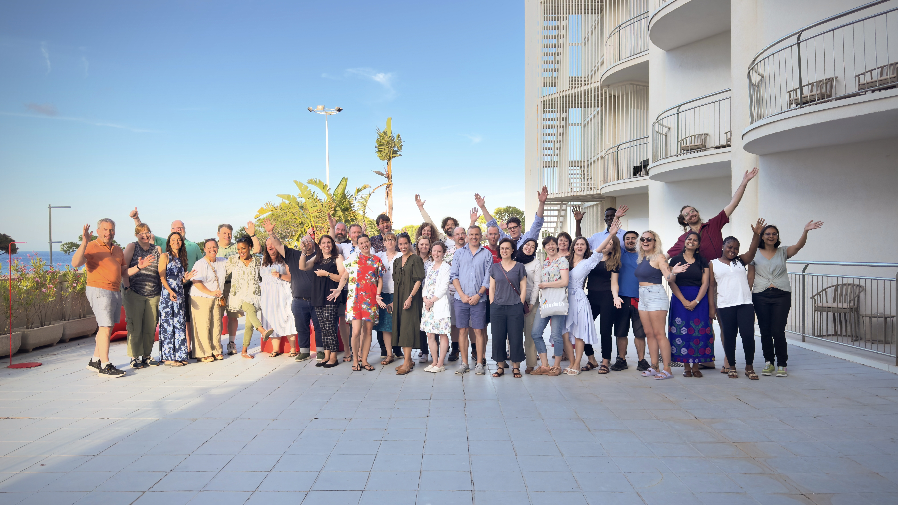
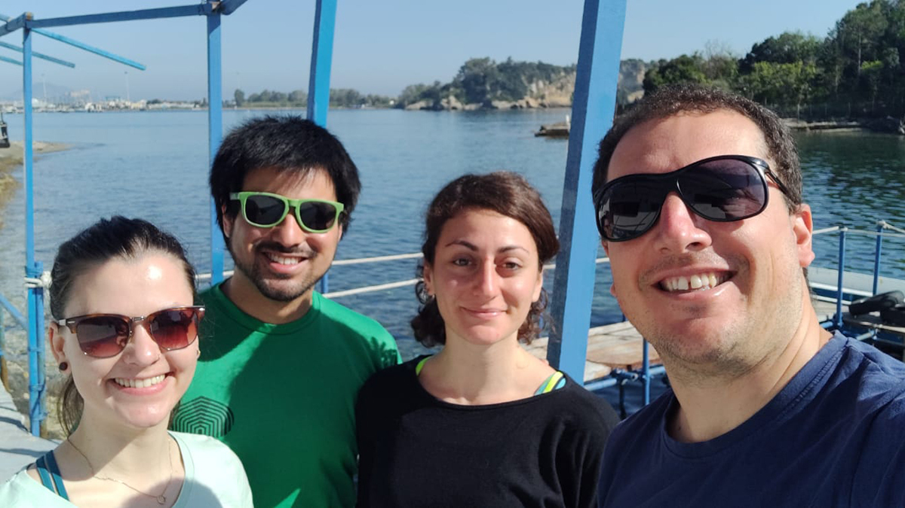
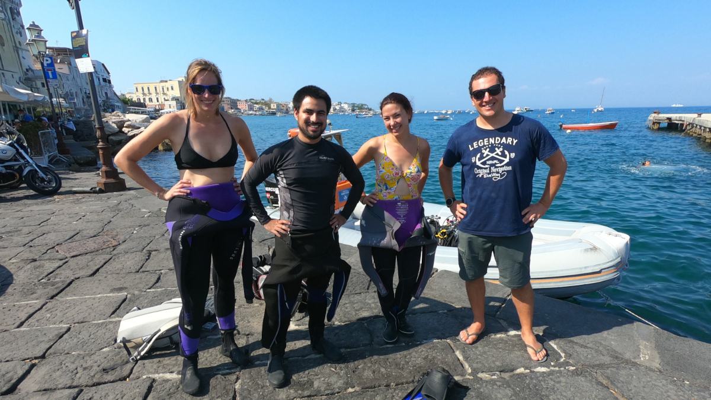
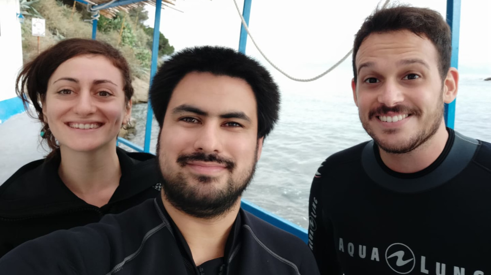
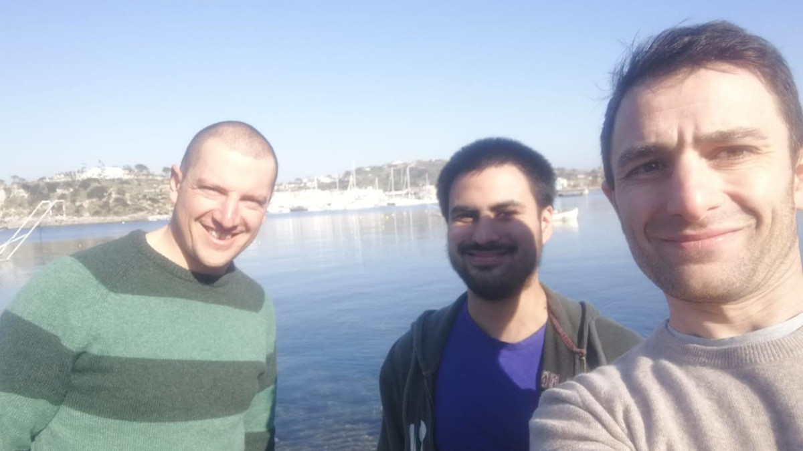
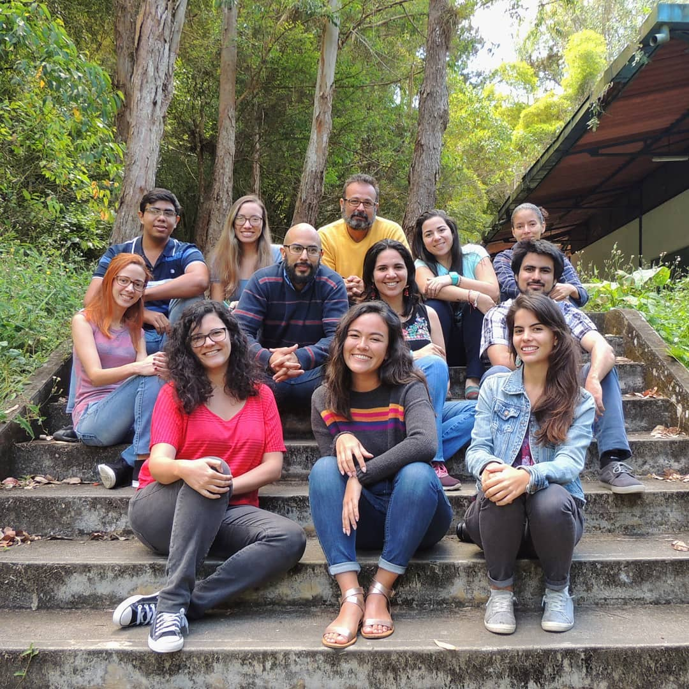
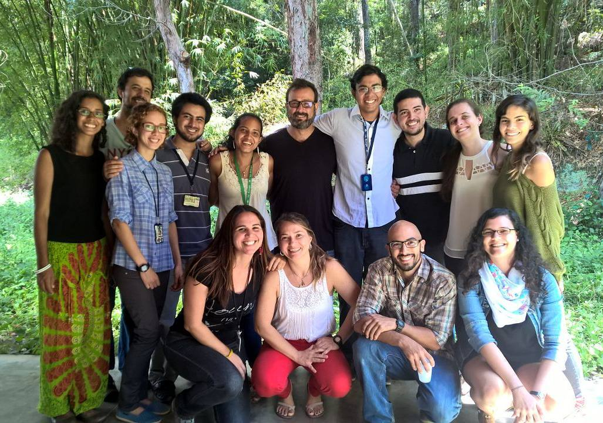
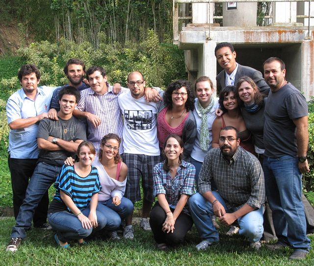

::: {.timeline .snake .tl-label-banner .tl-dotted}
::: {.event data-label="Present"}
### [Crossref](https://www.crossref.org/)

Since 2023, I've been part of the Community team as Technical Community Manager. As part of this role, among other things, I build and maintain relationships with the community that uses Crossref's metadata, I design and implement activities to engage all metadata users and grow the usage of the API.

{group="crossref"}
:::
::: {.event data-label="2023"}
### [The Directory of Open Access Journals](https://doaj.org/)

I joined the team at the Directory of Open Access Journals as a Managing Editor, and the experience was profoundly enriching. 

In this role, I undertook various responsibilities, including reviewing applications, journal records, and update requests. I also assessed recommendations provided by volunteer editors, assisting journals in meeting the inclusion criteria for DOAJ, enhancing adherence to best practices, and reporting cases of suspected predatory publishing for further investigation. 

This multifaceted role not only deepened my understanding of open access publishing but also allowed me to contribute actively to maintaining the quality and integrity of the journals associated with DOAJ.
:::
::: {.event data-label="2019-2023"}
### Marine Symbiomes Research Group ([Stazione Zoologica Anton Dohrn](https://szn.it/en/))
:::::::::::::: {.columns}
::: {.column width="47.5%"}
{group="marsym"}

{group="marsym"}

{group="marsym"}

{group="marsym"}
:::

::: {.column width="5%"}
:::

::: {.column width="47.5%"}

I started my Ph.D. at the Stazione Zoologica Anton Dohrn, Italy as part of the Marine Symbiomes Research Group. As part of our project, we explored the idea that invertebrate-bacterial associations may have a relevant role in nitrogen transformation processes through activity of their associated microbiome. 

Using a combination of field surveys, incubation experiments, stable isotope probing, and high-throughput sequencing, we explored the taxonomic and functional diversity of the microbiome and the contribution of invertebrate-bacterial associations to biogeochemical fluxes of nitrogen at the ecosystem level.
::::::::::::::

:::

:::
::: {.event data-label="2011-2019"}
### Experimental Ecology Laboratory ([Simón Bolívar University](https://www.usb.ve/))
:::::::::::::: {.columns}

::: {.column width="50%"}

During my Bachelor's at the Simon Bolivar University, Venezuela I joined the Experimental 
Ecology Laboratory, where I completed both my Bachelor's and Master's theses. There, the focus was on exploring ecological patterns and processes in coastal-marine ecosystems combining intensive fieldwork, manipulative experiments and multivariate data analysis.

:::

::: {.column width="47.5%"}
{group="lee"}

{group="lee"}

{group="lee"}

:::

::: {.column width="5%"}
:::

::::::::::::::

:::
:::

